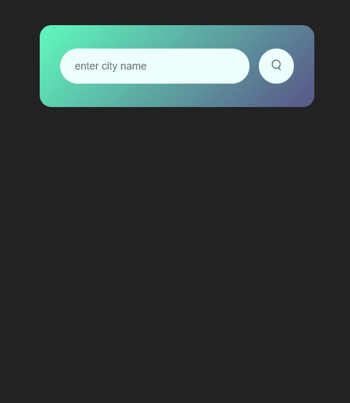

# Weather-App

### Weather app for website using HTML CSS and JavaScript. We will get current weather data from API from OpenWeatherMap. An app with a search box where you can type the city name and get weather information like temperature, weather conditions, humidity and wind speed.
---

